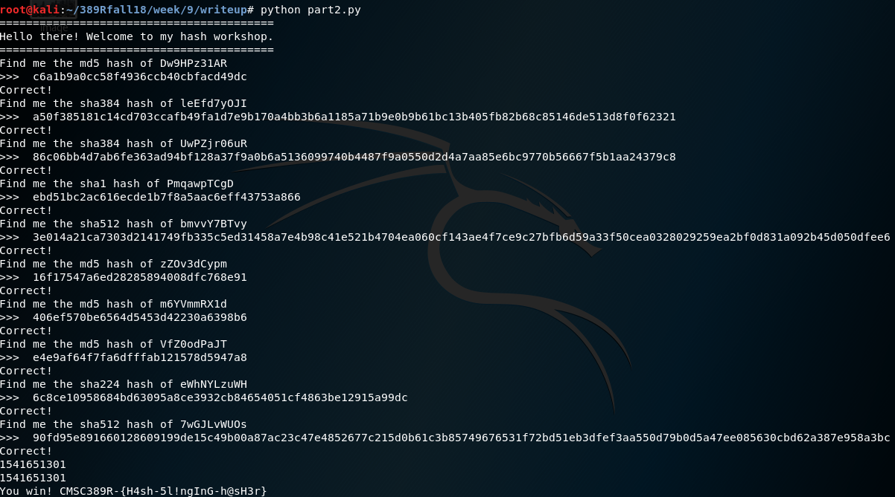

Writeup 9 - Crypto I
=====

Name: Tumie Hurd  
Section: 0101  

I pledge on my honor that I have not given or received anyunauthorized assistance on this assignment or examination.  

Digital acknowledgement of honor pledge: Tumie Hurd  

## Assignment 9 Writeup  

### Part 1 (60 Pts)  
Part 1 was pretty straightforward and I knew that I would need a nested loop to step through the words and lowercase characters. However, I kept getting the wrong hash when I was hashing ```salt + password```. After doing some debugging, I realized that there was a newline character on both the password and the input hash that I was comparing it with.  After splitting the passwords and input hashes on their newline character, the program worked.    
Below is a screenshot of the output from the program.  
    

### Part 2 (40 Pts)  
To solve task 2, I began by running the command given to us ```nc 142.93.117.193 7331```.  I saw that it was requesting the sha256 hash of a string.  I then went to Google, found the hash of that string and then entered it to see the format of the response.  After seeing the way the program behaved, I began writing code. I ran the program a bunch of times to see all the different hashing functions that we needed to be able to handle.  At first I didn't know how to concatenate the type of hash function directly with the hash command, so I just used a bunch of if else statements.  I ended up reducing my code by using the eval command.  After running the program, I found the flag ```CMSC389R-{H4sh-5l!ngInG-h@sH3r}```.  
Below is a screenshot of the output for my program.  



